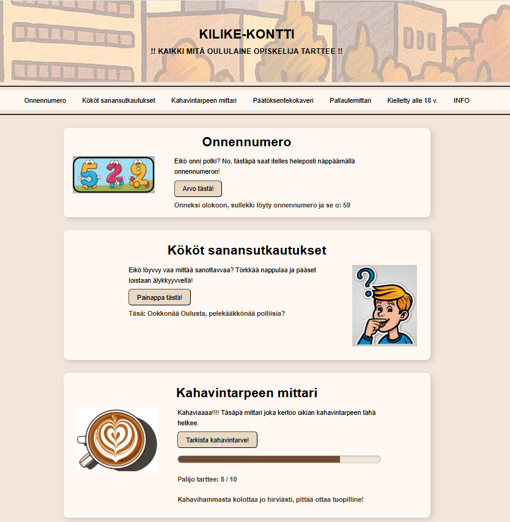
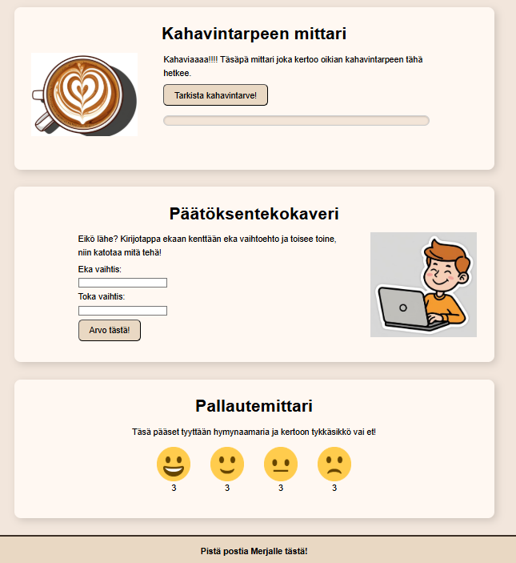
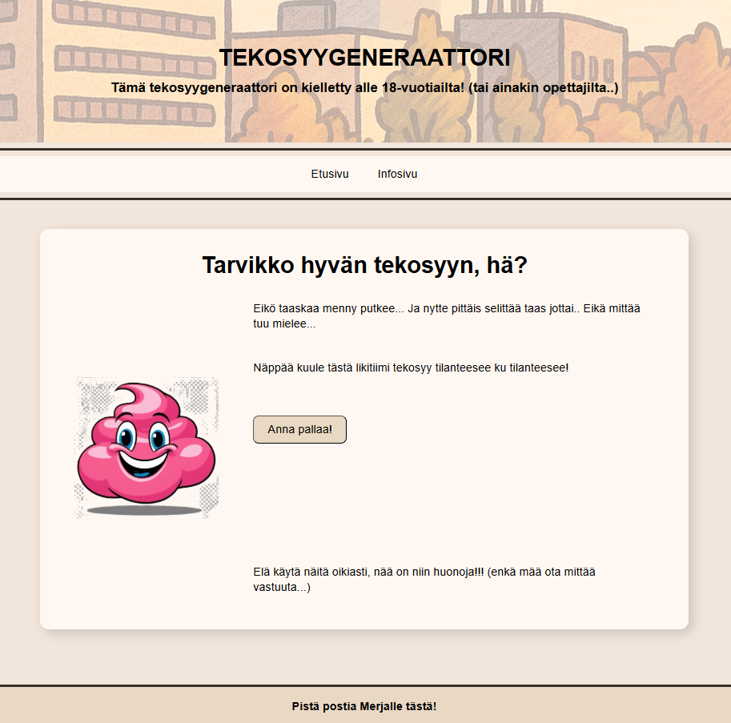
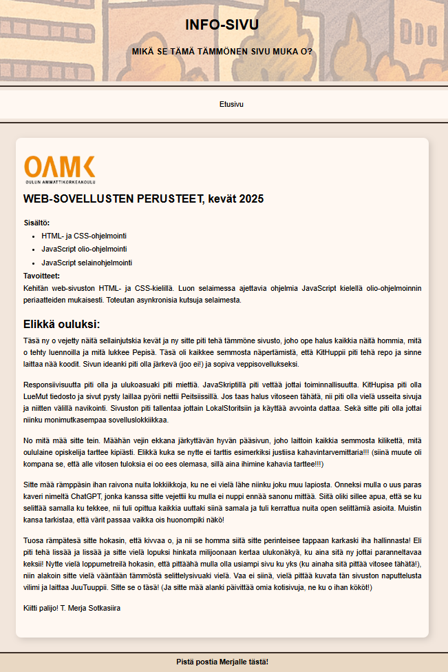

# Kilike-kontti

**Kilike-kontti** on oululaismurteella toteutettu responsiivinen verkkosivu, joka kokoaa yhteen opiskelijan elämää "helpottavia" toimintoja huumorilla höystettynä.

## Teknologiat

- HTML5
- CSS3 (mobiili ensin, responsiivinen asettelu)
- JavaScript (DOM, LocalStorage)
- Twemoji (hymiöpohjainen palautemittari)

## Tehtävänanto (Web-sovellusten perusteet, kevät 2025)

Tavoitteena oli toteuttaa JavaScriptillä toimiva, HTML- ja CSS-pohjainen verkkosivu, joka hyödyntää LocalStoragea, käyttäjän syötettä sekä ohjelmallista päätöksentekoa. Sivuston tuli olla responsiivinen ja käyttää useampaa erilaista toimintoa.

> Tämä toteutus noudattaa tehtävänantoa sisältämällä useita interaktiivisia osioita, oman visuaalisen ilmeen ja selkeän tiedostorakenteen.

## Toiminnot

- **Onnennumero** – Arpoo käyttäjälle satunnaisen onnennumeron
- **Kököt sanansutkautukset** – Generoi oululaisia sanontoja napinpainalluksella
- **Kahavintarpeen mittari** – Graafinen kahvihammasta kolottava mittari
- **Päätöksentekokaveri** – Auttaa valitsemaan kahden vaihtoehdon välillä
- **Pallautemittari** – Twemoji-hymiöillä toteutettu palautetyökalu (pisteet tallentuvat LocalStorageen)
- **Tekosyygeneraattori** (sivulla `tekosyyt.html`) – Vain yli 18-vuotiaille 😉
- **Infosivu** – Kertoo projektin taustasta, murteella tietenkin!

## 🗂 Tiedostorakenne

```
Kilike-kontti/
├── index.html
├── tekosyyt.html
├── info.html
├── css/
│   └── style.css
├── js/
│   └── functions.js
├── images/
│   ├── etusivu1.png
│   ├── etusivu2.png
│   ├── tekosyygeneraattori.png
│   ├── infosivu.png
│   └── muut kuvatiedostot
└── README.md
```

## Näyttökuvat

### Etusivu, osa 1  


### Etusivu, osa 2  


### Tekosyygeneraattori  


### Infosivu  


## Käyttöohje

1. Lataa projektin kansio koneellesi
2. Avaa `index.html` selaimessa (ei tarvita palvelinta)
3. Kaikki toimii suoraan paikallisesti (myös LocalStorage)

## Tekijä

**Merja Sotkasiira**  
Oulun ammattikorkeakoulu, Web-sovellusten perusteet (kevät 2025)  
**Sähköposti:** [msotkasi20@gmail.com](mailto:msotkasi20@gmail.com)


